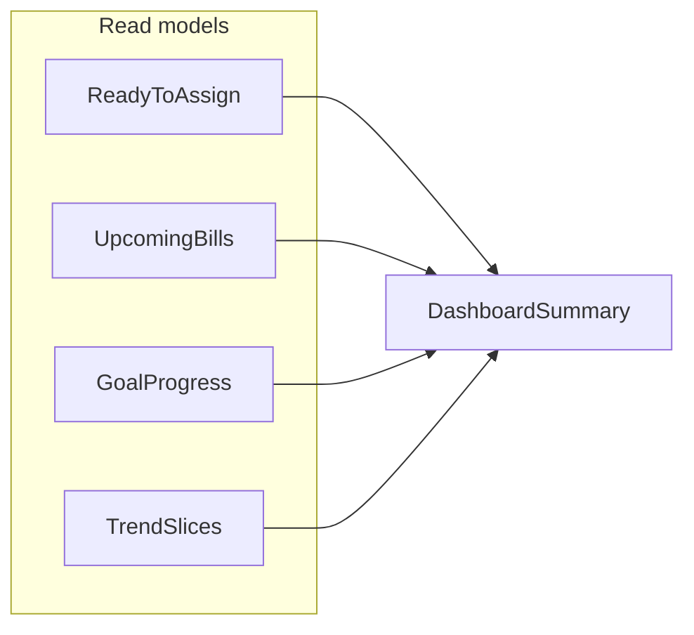

# Personal finance feature expansion (beyond [SPRINT_BOARD.md](SPRINT_BOARD.md))

## What you already cover (strong foundation)

Your backend stories align with a **YNAB-style envelope budget** plus operational finance: multi-budget, accounts, transactions/splits, **paired transfers**, budget months, assign/move money, recurring, CC statements, bills, goals/contributions, and read-only reports (net worth, cashflow, spending by category). That is already a complete *core* for serious day-to-day money management.

Gaps on the board itself (if not yet implemented elsewhere): **[BE-07](SPRINT_BOARD.md) / [BE-08**](SPRINT_BOARD.md) category groups & categories CRUD, and **[BE-G1](SPRINT_BOARD.md) / [BE-G2**](SPRINT_BOARD.md) automated guardrail suites—these are “table stakes” before layering advanced UX.

---

## High-value features many users expect (not yet named as stories)

Grouped by theme; each should stay **user-scoped**, **read-heavy where possible**, and **money in minor units**.

| Theme                                      | Why it matters                            | Fit with your model                                                         |
| ------------------------------------------ | ----------------------------------------- | --------------------------------------------------------------------------- |
| **Imports & bank sync**                    | Reduces manual entry; Plaid/FINICITY/etc. | New `connections` flows; reconcile rules; never bypass RLS                  |
| **Rules & auto-categorization**            | Scales transaction hygiene                | Rules on payee/amount/account → category; audit log                         |
| **Scheduled / pending transactions**       | Cashflow foresight                        | You have `transaction_status`; surface “upcoming” views                     |
| **Search & saved filters**                 | Power-user retention                      | Server-side query on description, merchant, tags, amount range              |
| **Attachments & notes**                    | Disputes, taxes, warranty                 | Blob storage + metadata; no PII in logs                                     |
| **Multi-currency / FX**                    | International users                       | You have `original_amount_minor`, `exchange_rate`; needs explicit policy    |
| **Debt payoff plans**                      | Motivation + clarity                      | Snowball/avalanche *schedules* linked to loans/CC accounts                  |
| **Investments (positions, not just cash)** | Net worth truth                           | Holdings snapshots; separate from budget “cash” envelope semantics          |
| **Tax / year-end reporting**               | High intent usage                         | Tag-based or category-based annual summaries (read-only aggregates)         |
| **Household / sharing**                    | Joint budgets                             | `account_ownership_type` exists; needs invitation, roles, RLS policy design |
| **Notifications & digest**                 | Engagement                                | Bill due, goal milestones, large transactions—async jobs                    |
| **Export (CSV/OFX)**                       | Trust + portability                       | Read-only export endpoints; same filters as list APIs                       |

---

## Dashboard: what to surface (backend-shaped)

A good **dashboard** is not one endpoint—it is a **composition** of small, cacheable reads:

- **Today**: Ready to Assign, overspent categories, bills due this week, upcoming recurring.
- **This month**: assignment vs activity vs available (you already have month/category semantics), cashflow trend, top spending categories.
- **Health**: credit utilization (from accounts + statements), goal progress, net worth delta vs last month.

Suggested direction: a `**GET /api/v1/dashboard/summary`** (or 2–3 focused resources) that **aggregates existing modules** without new business writes—keeps controllers thin and tests integration of invariants.

---

## What-if and planning: “unique” angles that fit a budgeting app

**Critical design choice:** what-if must **not mutate** the ledger or budget by default. Prefer **ephemeral simulations** or **named scenarios** stored separately from “actuals.”

### 1. Budget scenario sandbox (high differentiation)

- User clones a **month plan** into a **scenario** (delta on assignments, hypothetical income, delayed bills).
- Server returns projected **category available**, **RTA**, and **cash account runway** under assumptions.
- **Unique twist:** show **confidence bands** using last N months of actual spending (simple percentiles, not ML)—still explainable.

### 2. Cash runway & “safe to spend”

- Given scheduled outflows + recurring + average discretionary spend, compute **days of runway** per account or in aggregate.
- **Unique twist:** tie to **envelope coverage** (“Groceries covered until date X if spending matches trailing 4-week average”).

### 3. Goal impact calculator

- “If I contribute $X/month, target date moves from A → B” or “lump sum now vs monthly.”
- Pure domain math on top of existing goal types; easy to test.

### 4. Debt / interest what-if

- Simulate extra payment on CC/loan: interest saved, payoff date—**read-only** inputs from statement/loan metadata.

### 5. Life event templates

- Presets: job change (−income), new rent, baby, car replacement—adjust a **scenario** with sliders; compare to baseline month.

### 6. Stress test (conservative planning)

- Apply **+X% spending** or **−Y% income** across categories; surface first month categories go negative—actionable, not alarmist.

### 7. Decision compare (A vs B)

- Side-by-side: “pay debt vs fund emergency goal this month” under same RTA constraint—excellent for your **explicit assignment** model.

---

## Suggested prioritization (product + engineering risk)

1. **Close board gaps**: BE-07/08 if not done; BE-G1/G2 for safety nets.
2. **Dashboard summary API** (compose existing data; no new money mutations).
3. **Rules / automation** OR **imports** (pick one—both are large; imports changes ops most).
4. **Scenario engine v1**: single-month sandbox, ephemeral, full test coverage on RTA/category conservation under hypothetical assignments.
5. **Differentiators**: runway + goal-impact calculators (small surface, high clarity).

---

## Risks to call out early

- **What-if vs truth**: scenarios must be clearly labeled; avoid writing “phantom” transactions into `transactions` without a strong audit model.
- **Performance**: dashboard and reports benefit from **materialized snapshots** you already sketched (`monthly_*_snapshots`, `net_worth_snapshots`)—keep heavy reads off hot paths.
- **Correctness**: any simulator must reuse the same **assignment / move / RTA** domain rules as production ([DOMAIN_MODEL.md](DOMAIN_MODEL.md), [APPLICATION_INSTRUCTIONS.md](APPLICATION_INSTRUCTIONS.md)).

---

## Optional next step (if you want implementation later)

Translate the top 2–3 themes into new `BE-XX` tickets (dashboard aggregate, scenario sandbox, rules/import) with the same template already in the sprint board—each with explicit test files and “no mutation” acceptance criteria for simulation APIs.